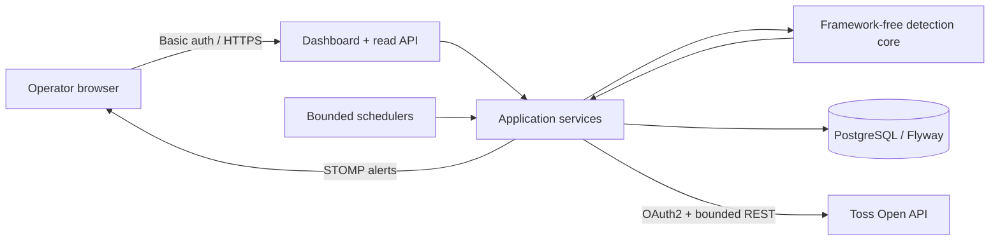

# MarketGuard

[](https://github.com/mytrashcan/MarketGuard/actions/workflows/ci.yml)

MarketGuard는 토스증권 Open API의 **공개 시장 데이터만 읽어** 규칙 기반 이상 징후를 탐지하고, 운영자 대시보드에 기록·알림하는 포트폴리오 프로젝트입니다.

> 주문, 계좌 조회, 이체, 자금 이동 기능은 구현하지 않습니다. 탐지 결과는 투자 조언이나 규제기관 수준의 시장감시 판정이 아닙니다.

## 핵심 특성

- 현재가·호가·캔들·가격제한폭·투자경고·거래 캘린더만 조회
- `BigDecimal` 기반 가격/비율 계산과 공식 시장 타임스탬프 보존
- 6개 독립 탐지 규칙, 구조화된 관측 근거, 규칙별 장애 격리, 영속적 원자 쿨다운
- 동일 종목 신호의 사건 그룹화, 설명 가능한 0~100 관심도 점수, 검토 상태·메모·이력
- 타임아웃, 공식 호출 그룹별 rate limit, 선택적 재시도, `Retry-After`, circuit breaker
- 운영자 HTTP Basic 인증, strict WebSocket Origin, 입력 제한, peer별 API rate limit, CSP/SRI
- PostgreSQL + Flyway + Hibernate schema validation
- Prometheus 지표, liveness/readiness, 안전한 감사 로그
- 실제 PostgreSQL Testcontainers 테스트와 Docker Compose 스모크 테스트

## 아키텍처



소스 의존성은 `config/collector/dashboard/domain -> application/detection` 방향입니다. `detection` 코어에는 Spring/JPA/외부 계층 import가 없으며 아키텍처 테스트가 이를 고정합니다. 상세 내용은 [architecture.md](docs/architecture.md)를 참고하세요.

## 탐지 규칙

| 규칙 | 판단 기준 |
|---|---|
| `PRICE_SPIKE` | 최근 가격 평균 대비 설정 비율 이상의 변동 |
| `PRICE_LIMIT` | 상·하한가 도달 또는 설정 비율 이내 근접 |
| `ORDERBOOK_IMBALANCE` | 총 매수/매도 잔량 비율이 임계값 이상 |
| `VOLUME_SURGE` | 최신 분봉 거래량이 직전 평균의 임계 배수 이상 |
| `INVESTMENT_WARNING` | 현재 유효한 투자경고·위험·단기과열·정리매매 지정 |
| `PRICE_VOLUME_SURGE` | 가격 변동과 1분 거래량이 각각의 임계값을 동시에 초과 |

각 신호는 제목·요약·쉬운 설명·관측값·기준값·임계값·비교 범위·맥락 태그·추가 확인 항목을 함께 저장합니다. 규칙은 독립적으로 실패하며, 한 규칙의 예외가 나머지 평가를 중단하지 않습니다. 시장 캘린더 조회에 실패하면 수집기는 stale 데이터 오탐을 피하기 위해 장 마감으로 처리합니다. 계산식과 경계 조건은 [탐지 규칙 문서](docs/detection-rules.md)를 참고하세요.

## 화면 수치의 의미

- 등락률은 토스 랭킹 응답이 동일 집계 시각에 제공한 `lastPrice`, `basePrice`, `changeRate`를 한 묶음으로 사용합니다. 랭킹에 없는 종목만 무수정 일봉으로 계산하며 API/UI에 출처를 표시합니다.
- “매수/매도”는 실제 체결 비율이나 투자자별 순매수가 아니라 공개 호가창의 **미체결 매수·매도 잔량 비율**입니다. 장외·미제공·upstream 오류를 0과 구분합니다.
- 탐지 사건은 종목명과 종목코드를 함께 저장합니다. 기존 데이터는 마이그레이션 시 종목코드를 안전한 이름 폴백으로 사용합니다.

## 빠른 시작

요구 사항은 JDK 17과 Docker입니다.

```bash
./gradlew clean test
./gradlew bootRun
```

기본 프로파일은 안전한 로컬 개발 모드입니다.

- `127.0.0.1:5050`에만 바인딩
- 수집기 비활성화
- 인증 비활성화
- 메모리 H2와 로컬 H2 콘솔 사용

대시보드: `http://127.0.0.1:5050/`

실제 수집을 켜려면 토스 자격 증명이 필요하며, 하나라도 빠지면 기동이 실패합니다.

```bash
export TOSS_CLIENT_ID='...'
export TOSS_CLIENT_SECRET='...'
export COLLECTOR_ENABLED=true
./gradlew bootRun
```

## Docker Compose

```bash
cp .env.example .env
# .env의 필수 값을 편집
docker compose up --build --wait
```

`collector=false`이면 Toss 자격 증명 없이 안전한 운영 패키지를 확인할 수 있습니다. 실제 수집 시에만 `TOSS_CLIENT_ID`, `TOSS_CLIENT_SECRET`, `COLLECTOR_ENABLED=true`를 설정하세요.

Compose는 다음을 강제합니다.

- DB 비밀번호에는 기본값이 없고, 인증을 켠 경우 운영자 비밀번호 누락 시 기동 실패
- PostgreSQL 호스트 포트 미공개 및 named volume 사용
- 앱 포트는 호스트 loopback에만 공개
- non-root 앱, read-only root filesystem, capability 제거
- readiness 통과 후 healthy 처리

재현 가능한 전체 스모크:

```bash
./scripts/compose-smoke.sh
```

## API와 운영 엔드포인트

운영 프로파일은 기본적으로 probes를 제외한 모든 경로에 인증을 요구합니다. 호스트 loopback에서만 사용하는
개인용 배포는 `.env`의 `MARKETGUARD_SECURITY_ENABLED=false`로 로그인 화면을 끌 수 있습니다. 이 값을 끈
상태로 포트를 외부에 공개하거나 인증 없는 reverse proxy에 연결하면 안 됩니다.
아래 익명 접근 표는 기본값인 인증 활성화 모드를 기준으로 합니다.

| 경로 | 설명 | 익명 접근 |
|---|---|---|
| `GET /api/prices/live` | watch list 현재 보드 | 아니요 |
| `GET /api/stocks/{code}/candles?interval=1m&count=60` | 1분/일 캔들, `count=1..200` | 아니요 |
| `GET /api/anomalies?limit=50` | 최근 이상 기록, `limit=1..200` | 아니요 |
| `GET /api/anomalies/{id}` | 구조화된 단일 신호 근거 | 아니요 |
| `GET /api/cases?...` | 사건 목록, pagination과 상태/규칙/심각도/종목/시간/점수 필터 | 아니요 |
| `GET /api/cases/{id}` | 점수 구성·타임라인·메모·상태 이력 | 아니요 |
| `PATCH /api/cases/{id}/status` | 버전 기반 상태 변경 | 아니요 |
| `POST /api/cases/{id}/notes` | 검토 메모 추가 | 아니요 |
| `GET /api/stocks/{code}/context` | 가격·거래량 차트와 현재 가용 시장 맥락 | 아니요 |
| `GET /api/analytics/rules` | 규칙별 발생·기각·상위 검토·평균 검토시간 | 아니요 |
| `GET /api/csrf` | 브라우저 쓰기 요청용 CSRF 토큰 | 아니요 |
| `GET /api/audit?limit=100` | 최근 감사 기록 | 아니요 |
| `GET /api/stocks/{code}/snapshots?limit=50` | 최근 시세 스냅샷 | 아니요 |
| `GET /actuator/health/liveness` | 프로세스 생존 | 예 |
| `GET /actuator/health/readiness` | 앱/DB 준비 상태 | 예 |
| `GET /actuator/prometheus` | Prometheus 지표 | 아니요 |

잘못된 입력은 안정적인 `400` JSON으로, 영구 upstream 오류는 `502`, 일시적 오류/회로 차단은 `503`으로 반환합니다. 내부 예외·upstream body·자격 증명은 응답에 포함하지 않습니다.

## 검증

```bash
# Docker 소켓이 없으면 PostgreSQL 통합 테스트는 성공으로 건너뛰지 않고 실패합니다.
./gradlew clean check bootJar
docker build -t marketguard:local .
./scripts/compose-smoke.sh
```

CI는 Gradle wrapper 검증, 전체 테스트, 65% line coverage gate, CodeQL/dependency review, hardened image build/scan, Compose 스모크를 수행합니다. GitHub Actions와 Docker base image는 commit/digest로 고정했습니다.

## 운영과 보안

- 운영 실행, TLS reverse proxy, 백업/복구, 지표/알림: [operations.md](docs/operations.md)
- 신뢰 경계와 보안 통제: [threat-model.md](docs/threat-model.md)
- 설계와 계층 규칙: [architecture.md](docs/architecture.md)
- 사건 API 계약: [api.md](docs/api.md)
- 복합 점수: [composite-score.md](docs/composite-score.md)
- 검토 상태 전이: [case-workflow.md](docs/case-workflow.md)
- 데이터 모델: [data-model.md](docs/data-model.md)
- 오탐과 한계: [false-positives-and-limitations.md](docs/false-positives-and-limitations.md)
- 취약점 보고와 시크릿 지침: [SECURITY.md](SECURITY.md)
- 초기 감사 결과와 해소 상태: [production-readiness.md](docs/review/production-readiness.md)

## 제약 사항

- Toss는 client당 유효 토큰 하나만 허용하므로 동일 client credential을 공유하는 앱 replica는 **1개만** 지원합니다.
- 내장 STOMP broker와 API rate limiter는 단일 프로세스 범위입니다.
- 알림 전송은 DB commit 이후 best-effort입니다. 연결이 끊긴 브라우저는 DB의 최근 anomaly API로 복구합니다.
- anomaly/audit 장기 보존 정책은 운영 환경의 규제·비용 요구에 맞춰 별도로 정해야 합니다.
- 공개 배포는 TLS reverse proxy와 네트워크 ACL 뒤에서만 수행해야 합니다.
- 업종/시장지수 시계열, 공시, 뉴스, corporate action 데이터가 없어 상대수익률과 이벤트 맥락은 임의 생성하지 않습니다. 현재 API는 해당 맥락을 `unavailable`로 명시합니다.
