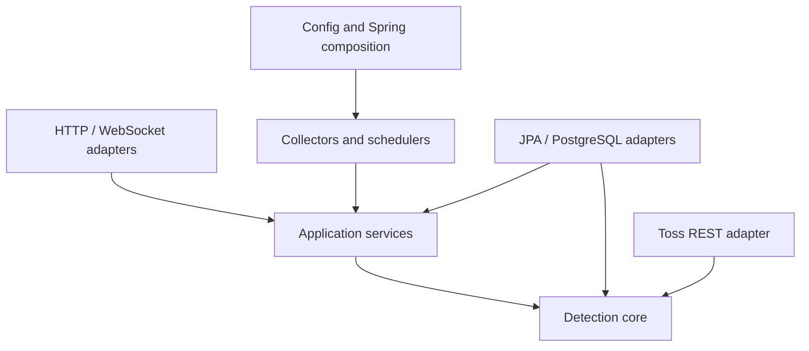

# Architecture

## System boundary

MarketGuard reads market information, evaluates deterministic rules, persists evidence, and publishes operator notifications. It never calls account, order, transfer, or fund APIs.

Dependencies point inward. `detection` contains values, rule contracts, rule implementations, decimal policy, and the rule engine. It has no Spring, JPA, HTTP, or persistence dependency. `DetectionConfig` composes validated external configuration into core constructors. `application` owns transactional use cases. Outer adapters map DTOs/entities at their boundaries.

`ArchitectureDependencyTest` prevents Spring, JPA, config, collector, dashboard, and persistence imports from entering `detection`.

## Important flows

1. A fixed-delay collector acquires an in-process overlap guard.
2. Official KRX calendar state gates scans; an unavailable calendar fails closed.
3. Current prices are fetched in batches of at most 200 using documented API rate groups.
4. Official timestamps and decimal prices are mapped to `MarketPrice`.
5. The rule engine evaluates each rule independently.
6. A PostgreSQL `INSERT ... ON CONFLICT ... WHERE` atomically acquires `(stock, rule)` cooldown.
7. The anomaly record commits in the same transaction; notifications occur afterward.

## Consistency model

- Price snapshots and anomaly records are durable in PostgreSQL.
- Cooldown is durable and concurrency-safe across processes sharing one database.
- WebSocket publication is at-least-never guaranteed: it is best-effort after commit. Clients recover through the recent anomaly endpoint.
- A single app replica is supported because Toss token issuance invalidates the previous token for the same client.

## Calculation policy

All financial values use `BigDecimal`. Intermediate division uses scale 8 and `HALF_UP`; operator display uses scale 2. Prices must be positive, volumes non-negative, OHLC values internally consistent, stock codes six digits, and thresholds are validated at startup and again at core constructors.
