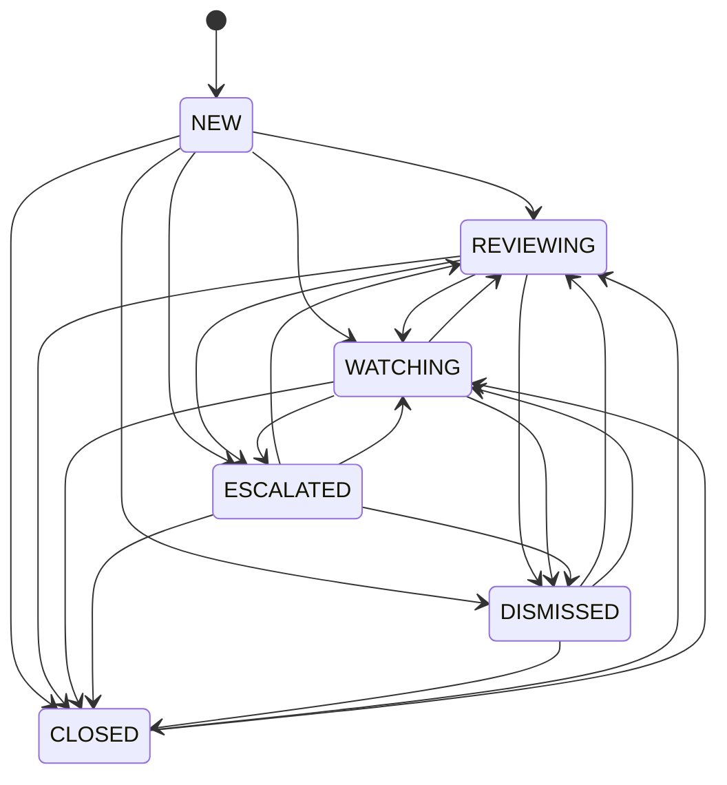

# Case grouping and review workflow

## Automatic lifecycle

1. Cooldown atomically decides whether a `(stock, rule)` signal may be recorded.
2. A separate per-stock database row lock serializes grouping.
3. A signal within the grouping window merges into the active case.
4. A later signal creates a new case and closes the previous active case for inactivity.
5. A terminal case inside the reactivation window is reopened as `NEW` when a new signal arrives.
6. A scheduler closes active cases that exceed the inactivity timeout.

Defaults are a 10-minute grouping window, 20-minute inactivity timeout, and 30-minute reactivation window. These are configurable durations.

## Operator states

`DISMISSED` and `CLOSED` require one of the enumerated closure reasons. Status writes require the current case version; conflicting updates return HTTP 409. The authenticated operator is recorded as reviewer. Status history and notes are append-only, and a bounded metadata entry is also written to the general audit log.
